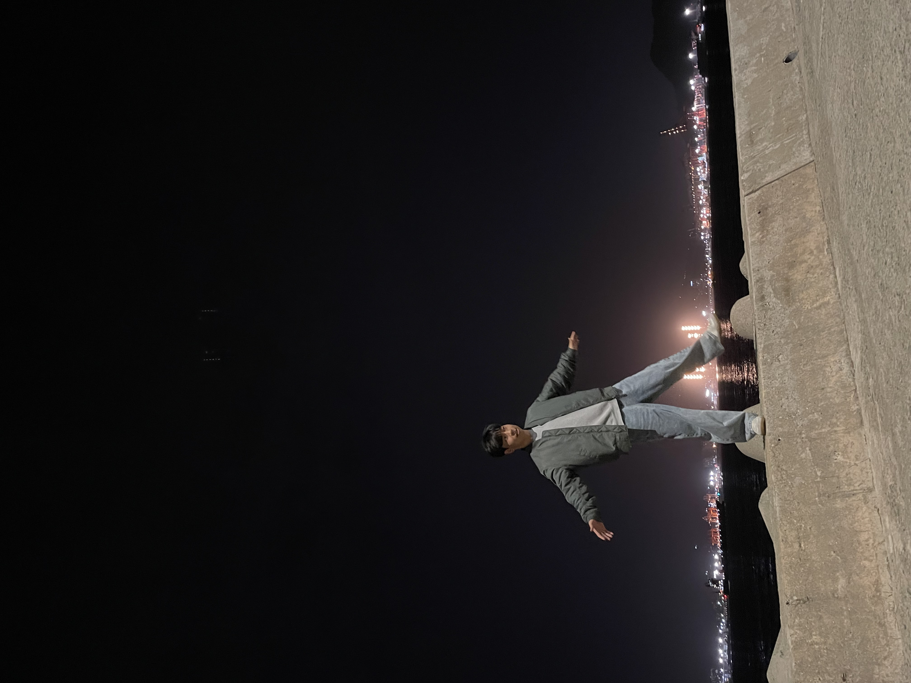

# 안녕하세요. 이상준입니다.

Github: <a href="https://github.com/J-1ac">@J-1ac</a>

Email: developj1ac@gmail.com

<h3 align="center">
    
  
아이디어를 현실 솔루션으로 제안할 수 있는 개발자를 희망합니다.
 
  
자기소개 야야야

</h3>

<h2 align="center">
  <b>Experience</b> 
</h2>

- **2020 컴퓨터기초실험 프로젝트 - 마스크 자동 살균기 제작**
    - 당시 코로나 19와 마스크 대란으로 인해 비말 차단용 마스크를 구하기 어려워지자, 이를 해결하기 위해 Arduino를 활용하여 일회용 마스크를 알코올과 자외선을 이용해 자동으로 소독하는 시스템을 구축하여 다회 사용할 수 있는 솔루션을 제안하였습니다.

- **2023 부산 연합 IT 동아리 PROJECT - MemeStore 개발 (BE) [MemeStore](https://github.com/WebPHub/MemeStore)** 
    - 부산 연합 개발 동아리인 PROJECT에서 Meme Store란 밈 제작 웹사이트를 개발했습니다. 다양한 배경, 전공을 가진 팀원들과 협업하여 프로젝트를 설계하고 수행하는 과정에서 많은 경험을 얻었습니다. 특히 현업으로 개발한 경험을 가진 팀원으로부터 많은 배움을 가져 늘 실무에서는 어떤 방식으로 구현해야할지 고민하게 된 계기가 되었습니다.

- **2023 DX Living Solution 공모전 - 세탁기 시뮬레이터의 알고리즘 구현 및 결함 분석 도구 개발 (통신 및 알고리즘 구현) [DXLivingSol](https://github.com/J-1ac/DXLivingSol)**
    - LG전자와 산학공모전을 진행하여 실제 세탁기의 PCBA를 Arduino와 Serial통신을 이용해 부하 없이 가상으로 사이클을 동작하여 제작 전 미리 결함을 예방하는 시스템을 구축하였습니다. Serial 통신과 각 부하의 알고리즘의 구현을 담당하였으며, 팀원 중 유일한 컴퓨터공학전공으로서 다른 전공의 팀원들과의 협력을 통해 솔루션을 제시하는 방식을 배운 귀중한 경험이었습니다.

- **2023 부산대학교 SW 교육센터 주관 백엔드 미니 캠프 수강중**
    - 백엔드 미니 캠프를 통해 백엔드 개발자로서 성장하기 위해 MVC 패턴, JPQL, Spring boot, Docker, AWS 등 다양한 기술을 학습하고 있습니다.

<h2 align="center">
  <b>Awards</b> 
</h2>

- 2020 부산대학교 컴퓨터기초실험 프로젝트 우수상 (부산대학교 정보컴퓨터공학전공주임상)
- DX Living Solution 공모전 우수상 (부산대학교 공과대학장상)
- 2023 PNU Tiny ML Challenge 2023 금상 (부산대학교 정보의생명공학대학장상)

<h2 align="center">
  <b>Skills</b> 
</h2>

- Languages: Java, C++, Python, SQL, JavaScript, C, Kotlin..
- Frameworks: Spring Boot
- Database: H2, PostgreSQL

<h2 align="center">
  <b>Education</b> 
</h2>

- March 2019 ~ Present: Pusan National University, Computer Science and Engineering Department.
- Undergraduate, Junior

<h2 align="center">
  <b>Other Experiences</b> 
</h2>

- 2020 한국장학재단 하계 다문화 및 탈북학생 농어촌 멘토링
- 2020 한국장학재단 동계 다문화 및 탈북학생 농어촌 멘토링
- 2023 대학생 학습지원 튜터링
    - 다양한 교육 봉사 활동에 꾸준히 참여하며 제가 받은 교육의 기회를 당연히 여기지 말고, 가진 지식을 아이들에게 나누고자 노력했습니다. 